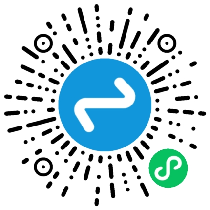

# 积分制管理系统——用数据重塑企业激励机制

**核心理念**：通过积分量化员工能力与综合表现，与多元福利深度挂钩，激发组织活力。

---

## 一、系统价值：直击企业管理痛点

| 痛点场景                | 解决方案                  | 核心优势              |
|-------------------------|---------------------------|-----------------------|
| ❌ 制度缺乏执行力       | 扣分替代罚款，柔性约束    | 增强制度接受度        |
| ❌ 分配机制不公平       | 积分排名透明化，福利倾斜高分者 | 打破平均主义          |
| ❌ 人才流失严重         | 终身积分制+长期福利绑定   | 提升人才黏性         |
| ❌ 激励成本过高         | 积分无金钱成本            | 0成本激励             |
| ❌ 精神需求未满足       | 积分排名体现地位与成就感  | 满足高阶成就感        |

---

## 二、核心功能体系

### 1. 自动化积分管理
- **固定积分自动生成**：学历、职称等固定项自动计算积分
- **动态积分实时记录**：任务完成、创新贡献、特殊行为等实时积分
- **全流程覆盖**：积分申请 → 多级审批 → 排名更新 → 福利兑换 → 数据分析

### 2. 多维度激励场景
- **任务大厅**：发布/领取任务，积分即时到账
- **积分商城**：商品管理与兑换订单追踪
- **动态圈**：实时展示积分变动和成就榜单

### 3. 智能分析中枢
- **部门/员工排名**：多维度排名榜单，激发竞争意识
- **积分记录分析**：积分获取趋势与行为关联分析
- **预测模型**：离职风险预警、激励效果热力图

---

## 三、技术架构优势

| 架构层级     | 技术选型                     | 核心价值                 |
|--------------|--------------------------|----------------------|
| **接入层**   | UniApp多端适配               | 支持Android/iOS/微信小程序  |
| **业务层**   | SpringBoot服务架构+Magic-api | 支持SaaS多租户，弹性扩容，轻量易拓展 |
| **数据层**   | MySQL + Redis            | 亿级行为记录毫秒响应           |
| **安全层**   | 多级权限控制 + 数据加密            | 保障企业数据安全             |

---

## 四、差异化福利体系（示例）

| 积分里程碑 | 福利项目                     | 激励导向               |
|------------|------------------------------|------------------------|
| 5,000      | 专属健身房会员卡（1年）       | 健康管理               |
| 15,000     | 企业内部高级管理培训          | 能力提升               |
| 50,000     | 办公室工位升级套装            | 工作环境优化           |
| 120,000    | 创新项目启动资金（1万元）     | 内部创业支持           |
| 400,000    | 公司内部创业孵化机会          | 核心人才绑定           |

> **✅ 终身有效机制**：积分不清零、不作废，福利可叠加升级

---

## 五、应用场景与效果

```diff
+ 制造业工厂案例：
  产量积分竞赛 → 班组生产效率提升30%
+ 互联网公司案例：
  技术创新积分激励 → 专利数量年增长150%
+ 县域治理案例：
  村民行为积分制 → 公共事务参与率达85%
```

## 六、演示demo

PC端：
```diff
网址：http://175.178.156.176:8039
组织代码：jfb

管理员身份：
账号：admin
密码：123123

员工身份：（目前给了和管理员一样的菜单，但是权限仅限于本部门）
账号：18012348888
密码：123456
```

微信小程序：



## 七、获取方式
```diff
限时特惠：移动端Uniapp（Android/iOS/微信小程序）8折

交付模式：

① SaaS云服务 ② 独立部署源码 ③ 混合架构方案


咨询：QQ 177478191
```
