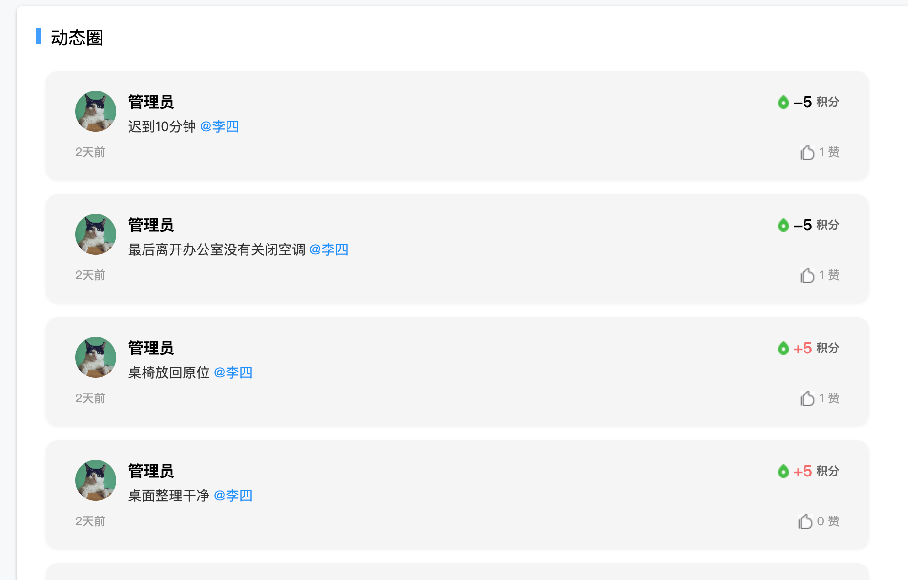
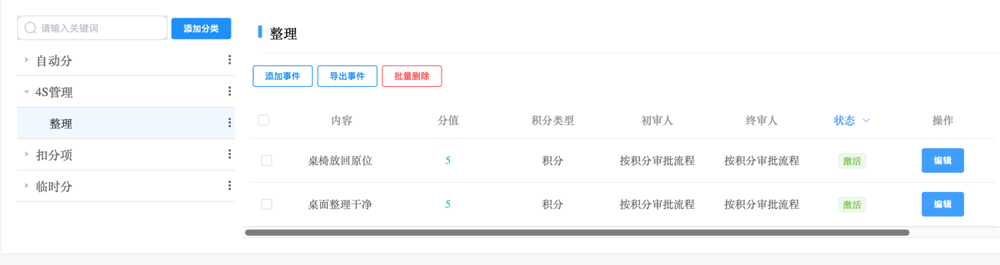
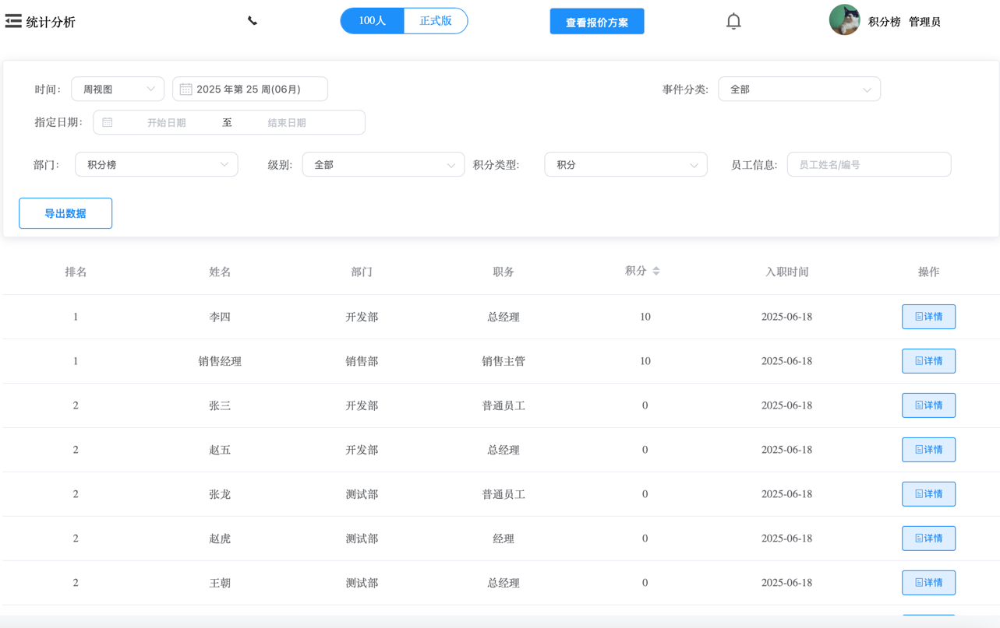

# 积分制管理系统介绍

### 功能展望
- 微信小程序在抓紧适配上架中

### 核心功能
- **自动化管理**
    - 固定积分（学历、职称等）自动生成。
- **全流程覆盖**
    - 积分申请、审核、排名、兑换商城、360度分析。
- **数据可视化**
    - 部门/员工积分排名、综合分析报表。

### 功能模块

- **首页**
    - 首页 ：作为进入软件后的起始页面，提供整体概览与快速入口。
    
  - 动态圈 ：展示各类动态信息，方便用户了解最新情况。
    
- **企业公告**
  - 发布公告 ：企业可在此发布相关公告，向员工传达重要信息。
  - 企业公告 ：集中展示已发布的各类企业公告内容。
- **任务管理**
  - 发布任务 ：创建并发布新的任务，分配给相应人员。
    
  - 任务大厅 ：展示所有已发布的任务，员工可在此浏览并承接任务。
  - 我发布的 ：查看自己发布的所有任务，便于管理和跟进。
    
  - 我的任务 ：查看分配给自己的任务，了解任务进度与详情
    
- **积分管理**
  - 积分补录 ：对遗漏的积分进行补录操作，确保积分记录准确。
    
  - 积分申请 ：员工可在此申请积分，阐述申请理由及相关情况。
    
  - 我申请的 ：查看自己提交的积分申请记录，了解申请状态。
    
  - 我的审批 ：对他人提交的积分申请、任务等相关内容进行审批操作。
    
    
- **积分规则**
    - 积分规则管理 ：制定、修改和管理各类积分获取、使用的规则与标准。
      
- **积分商城**
  - 商品管理 ：管理积分商城内的商品信息，包括上下架、编辑商品详情等。
    
  - 添加商品 ：向积分商城新增商品，设置商品相关参数与兑换条件。
  - 兑换订单 ：处理和查看员工兑换商品的订单，跟踪兑换进度与状态。
- **统计分析**
  - 部门排名 ：依据积分等数据对部门进行排名，激励部门竞争。
    
  - 员工排名 ：展示员工的积分排名情况，激发员工积极性。
    
  - 积分记录 ：记录所有积分的变动情况，方便查询与核对。
    
  - 数据分析 ：对各类数据进行深度分析，辅助企业决策和优化管理。
    
- **系统管理**
  - 企业信息 ：管理企业的基本信息，保持企业资料的准确与最新。
  - 
  - 组织架构 ：构建和维护企业的组织架构，明确部门与人员关系。
    
  - 职务管理 ：管理企业内的职务信息，包括职务权限等设置。
    
  - 级别权限 ：设定不同级别员工的权限范围，保障系统安全与数据保密。
  - 审批流程 ：配置和管理各类审批流程，提高审批效率与规范性。
  - 段位设置 ：设置员工段位体系，与积分、福利等挂钩，激励员工成长。
  - 生日提醒 ：设置生日提醒功能，便于企业关怀员工，增强员工归属感。
  - 菜单管理 ：管理软件的菜单显示与设置，方便用户操作与使用。

### 技术架构
- 基于**云计算与微服务架构**，高可靠性。
- 支持权限管理、任务分配、等级体系、奖励机制。

### 演示地址

- 网址：http://175.178.156.176:8039
- 组织代码：jfb
- 账号：admin
- 密码：123123

### 联系我们
**服务QQ：177478191**  
**企业要发展，管理必须要创新！**
**有意向代理的也欢迎添加联系方式**

# 积分制管理系统的介绍

## 企业管理痛点
- ❌ **制度缺乏执行力**  
- ❌ **分配机制不公平**  
- ❌ **人才流失严重**  
- ❌ **企业文化不健康**  
- ❌ **激励成本过高**  
- ❌ **员工精神需求未满足**

---

## 什么是积分制管理？
### 核心理念
- 通过**奖分**和**扣分**量化员工能力与综合表现，积分与福利挂钩，激发员工主观能动性。
- **核心价值**：数据化评估贡献，跨行业适用，无需修改原有制度。

### 核心优势
1. **增强制度执行力**  
   - 扣分替代罚款，更人性化，员工易接受。
2. **满足精神需求**  
   - 积分终身累计，排名体现地位与成就感。
3. **打破平均主义**  
   - 福利向高分倾斜，公开透明激励团队。
4. **留住核心人才**  
   - 高积分员工不愿离职，解决高薪留人难题。
5. **塑造健康文化**  
   - 奖分培养好习惯，扣分约束坏行为。
6. **降低管理成本**  
   - 积分无金钱成本，激励资源无限。

---

## 积分制管理特点
- **灵活适配**：不限企业规模与行业。
- **简单易用**：加减分操作，无需复杂理论。
- **数字化支撑**：配套积分管理系统，实现自动化、无纸化。
- **长期有效**：积分终身累计，不清零、不作废。

---

## 积分与福利挂钩场景
| 积分等级   | 福利项目                 |
| ------ | -------------------- |
| 5000积分 | 专属健身房会员卡（1年）         |
| 8000积分 | 定制健康体检套餐             |
| 1.5万积分 | 免费语言课程（英语/小语种）       |
| 2万积分   | 家庭亲子活动日邀请            |
| 5万积分   | 办公室工位升级（舒适座椅、双屏显示器等） |
| 8万积分   | 职业发展导师一对一辅导（半年）      |
| 12万积分  | 公司内部创新项目启动资金（1万元）    |
| 15万积分  | 企业内部高级管理培训课程         |
| 25万积分  | 公司组织的海外学术交流机会        |
| 35万积分  | 个人品牌推广项目（公司资源支持）     |
| 40万积分  | 公司内部创业孵化机会（团队组建支持）   |

---

